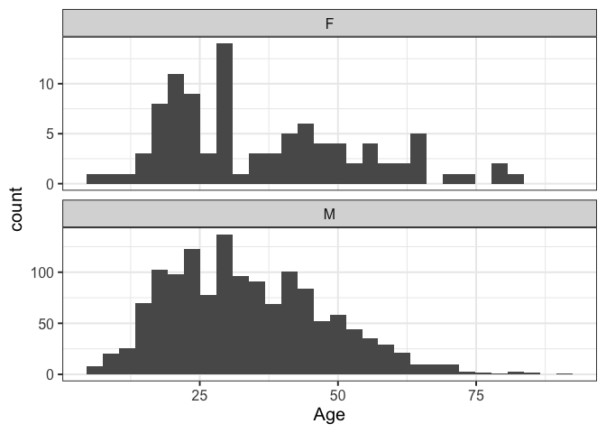

Sex differences in hunting data from Koster et al. (2020)
================
Edward H. Hagen

<!-- README.md is generated from README.Rmd. Please edit that file -->

<!-- badges: start -->

DOI: <https://doi.org/10.5281/zenodo.18645441> <!-- badges: end -->

The code in this repo generates a plot of the hunting data in:

Koster, J., McElreath, R., Hill, K., Yu, D., Shepard Jr, G., Van Vliet,
N., … & Ross, C. (2020). The life history of human foraging:
Cross-cultural and individual variation. Science Advances, 6(26),
eaax9070. <https://doi.org/10.1126/sciadv.aax9070>

The data for the Koster et al. (2020) study was obtained here:

<https://github.com/rmcelreath/cchunts>

## Installation

Download the project repo, open it in RStudio, and install these `r`
packages:

    tidyverse
    ggtext
    cchunts # From github (see above)

## Generate this page

    devtools::build_readme()

## Introduction

Koster et al. (2020) investigated hunting skill as a function of age. It
was not a study of sex differences in hunting, but data collection was
not restricted to male hunting. Some of the societies are
hunter-gatherers, but many are not.

Here is the Koster et al. description of their dataset (from their SI,
with my emphasis in **bold**):

> The total sample contains 1,821 individual hunter, 23,747 hunter-level
> outcomes, and 21,160 trips across 40 study sites. To compile the
> dataset, the first author searched for rel evant studies on
> subsistence hunting in the anthropological and biological literature,
> subsequently contacting authors to invite them to contribute data. The
> contributors submitted data in a standardized format that included
> variables for the biomass acquired on terrestrial hunting trips, the
> ages of the hunters at the time of the hunt, the duration of the trip,
> the hunting weaponry carried by the hunters, and the presence of dogs
> or assistants (the distinction between hunters and assistants was left
> to the discretion of contributors, who were counseled to conceptualize
> ”hunters” as those individuals who made active contributions to
> detecting and pursuing prey). Our data are restricted to hunting, and
> exclude gathering, because of the paucity of data on gathered plant
> foods.
>
> There is tremendous imbalance in sample size across units. One site
> contributes only 6 trips from 2 individuals. Another contributes more
> than 14,000 trips from 147 individuals. Some individuals contribute
> only a single outcome, while others contribute dozens. **The majority
> of the sample comprises male hunters, with too little data on female
> hunters to infer generalizable sex differences.** (This does not imply
> that men’s production and skill is more relevant to human evolution,
> nor that women’s foraging skill would necessarily exhibit either the
> same or a different functional relationship with age.) Most sites
> contribute primarily cross-sectional data, while a few others exhibit
> impressive time series. The statistical framework is designed to make
> use of all these data.

## Methods

The data comprise one row per hunting trip. Each row records the
quantity of meat returned in kilograms (harvest), the sex and age of
each member of the hunting party, and whether the harvest reflects meat
acquired only by the index hunter or the pooled quantity returned by the
hunting party.

Since the purpose of my analyses was to assess sex differences, I
removed the few hunting trips with mixed sex parties. I also added one
additional variable: whether the data contributed from each society had
at least one female coauthor on the associated paper.

## Results

There were 23781 hunting trips, 96.3% of which involved solo hunters,
and the remaining mostly groups of 2 or 3. There was possibly a sex bias
in data collection: most of the studies reporting female hunting (6/7)
had a female coauthor, although many studies with female coauthors did
not report female hunting (16/22):

``` r
tbl_coauthor
#>                    Female_hunting
#> Female_coauthorship FALSE TRUE
#>               FALSE    17    1
#>               TRUE     16    6
summary(tbl_coauthor)
#> Call: xtabs(formula = ~Female_coauthorship + Female_hunting, data = coauthor)
#> Number of cases in table: 40 
#> Number of factors: 2 
#> Test for independence of all factors:
#>  Chisq = 3.234, df = 1, p-value = 0.07212
#>  Chi-squared approximation may be incorrect
```

Keeping in mind the potential bias in data collection, there were
pronounced sex differences in these data. The breakdown of index hunters
by sex was 1411 males (92.6%) and 113 females (7.4%), for a total of
1524 index hunters (this is less than the total hunters, which also
included assistants).

This was the distribution of index hunter ages by sex:



To assess sex differences in hunting returns (harvests), I removed 116
hunting trips from the data (0.5%) that included hunting parties with
both males and females. Males returned a total of 255.4 metric tons of
meat, and females 0.7 metric tons. Removing hunting trips with pooled
harvests (N=2178), the mean hunting return for men was 9.5 kg, and for
women 1.4 kg. However, men returned empty handed in 47.8% of trips, and
women in only 29.2% of trips.

Finally, here is the distribution of returns by sex and society:

<figure>

<figcaption aria-hidden="true">Returns of subsistence hunting trips
(N=23,652) by 1,518 members of 40 forager and agricultural societies.
Row labels refer to the group and country from which the data were
collected (some studies did not include group names). Red labels
indicate studies with one or more female authors. Points indicate
returns of hunting trips (in kilograms). Point size indicates the number
of returns of that mass. X-axis is on a log scale (1 kg is added to the
mass of each return so that a return of 0, i.e., returning empty-handed,
is well-defined on a log scale). Rows are sorted by the mean return for
each society. Individual: returns are attributable to individual
hunters. Pooled: returns cannot be attributed to individual hunters.
Data from Koster et al. (2020). It is important to note that these data
are not necessarily representative of hunting patterns in foraging
groups, and that there are certainly biases</figcaption>
</figure>
